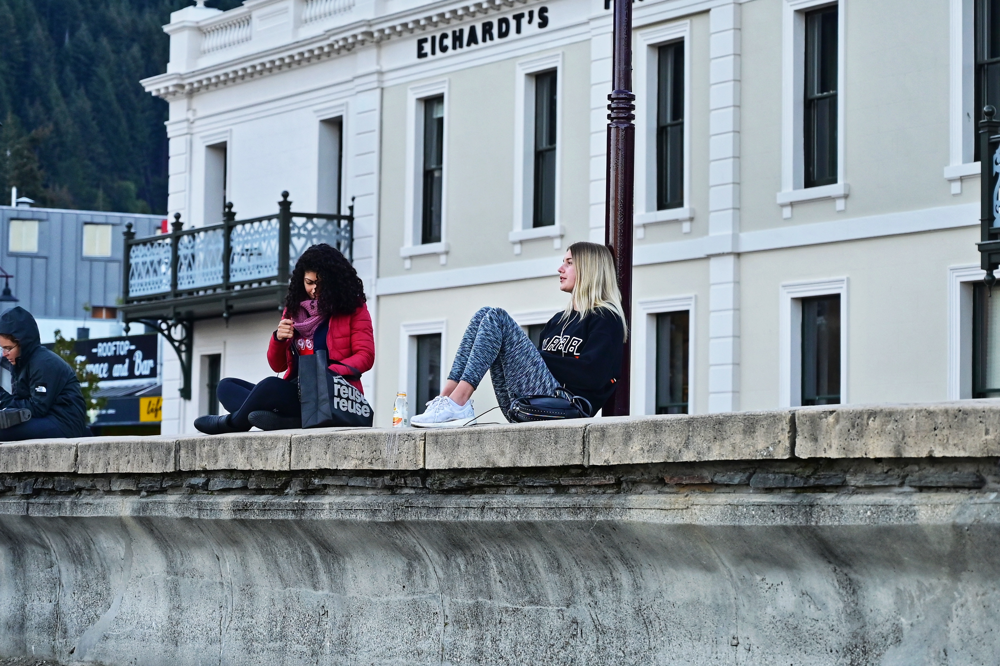
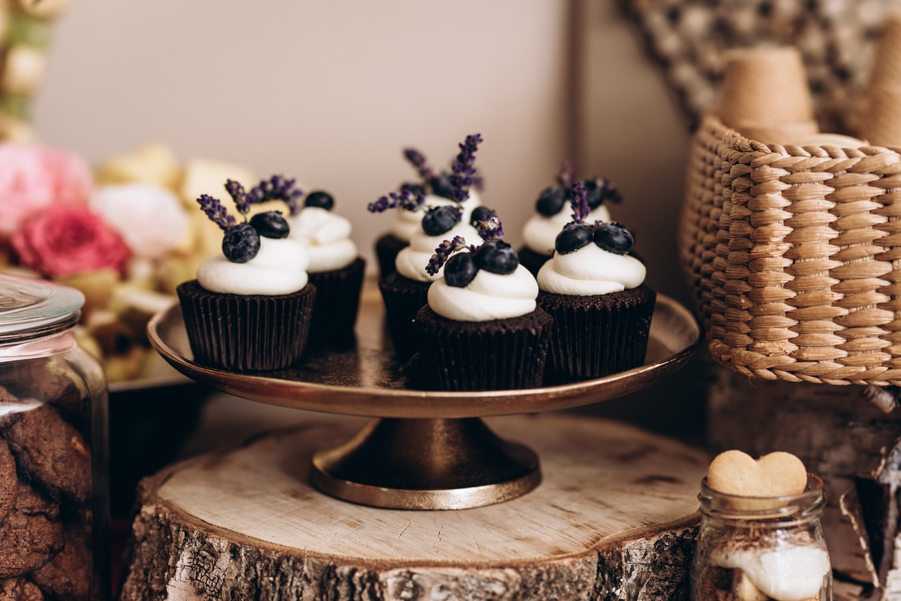
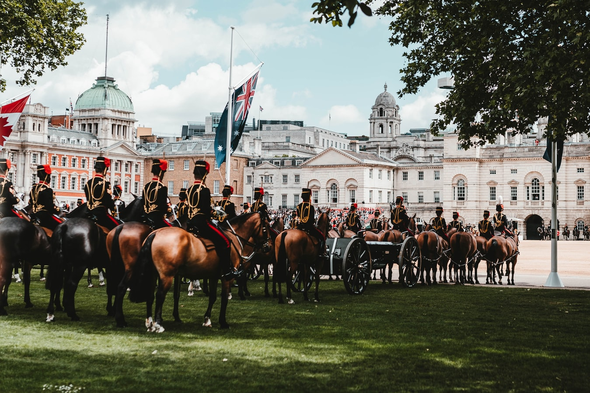
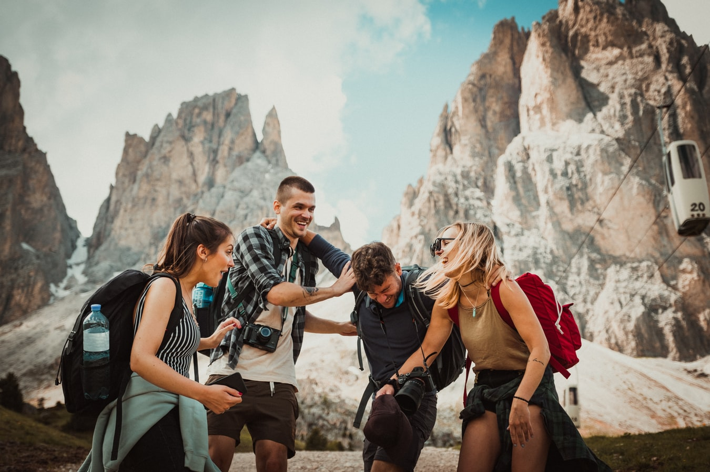
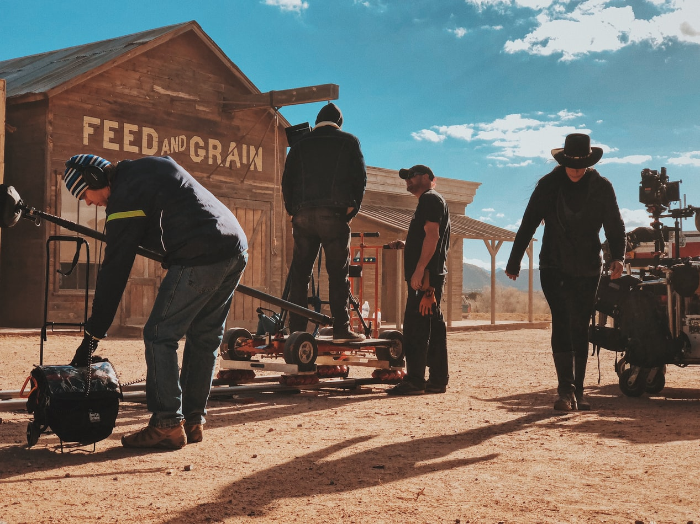

        2019年，分别在南北两个半球体验了秋季，上半年4月和虹仔去新西兰度假，正赶上南半球的初秋，正如飞机上的宣传片，果真是「100% Pure New Zealand」，纯净深邃的秋。
> @Lake Wakatipu, people around the lake

> @Llyn Padarn, The Lonely Tree

> @Pukaki Lake, self-driving tour

> @Lake Tekapo, stargazing tour

> @Matakana Farmers' Markets

> 相比较北京秋天的静谧，新西兰的秋景更加的热情，火辣。

        后记，今年想记录一下北京的秋天